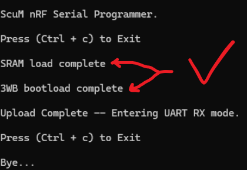

# SCuM Programmer

Load this firmware onto an nRF52840-DK to turn it into a programmer for SCuM!

The Single Chip micro-Mote (SCuM) is a 2x3mm2 single-chip standard-compatible Smart Dust chip, see https://www.crystalfree.org/

## Use

### program the nRF52840-DK

_Note_: you only need to do this once.

### Build / Install nRF52840-DK

- install SEGGER Embedded Studio for ARM (Nordic Edition)
- open `scum-programmer/scum-programmer.emProject`
- Build (F7)
- Target - Connect J-Link
- Target - Download scum-programmer


A single Python script is used to flash SCuM then listen over serial for messages coming through from SCuM's UART TX.

### Load code onto SCuM

Connect SCuM's pins to the corresponding nRF52840-DK pins.

| DK      | SCuM                     | description                         |
| ------- | ------------------------ | ----------------------------------- |
| `VBAT`  | `VDDIO`                  | provides power to SCuM (1.8V)       |
| `VBAT`  | `bootload src select`    | configure SCuM to bootload over 3wb |
| `P0.28` | `3WB_CLK`                | 3-wire bus, clock signal            |
| `P0.29` | `3WB_DATA`               | 3-wire bus, data signal             |
| `P0.30` | `3WB_EN`                 | 3-wire bus, enable signal           |
| `P0.31` | `HRESET`                 | hardware reset                      |
| `P0.03` | `VDDD`                   | to perform a "tap" operation        |

### Listen to SCuM's serial port

Connect SCuM's UART TX to the following pins on the nRF52840-DK.

| DK      | SCuM                     | description                         |
| ------- | ------------------------ | ----------------------------------- |
| `P0.02` | `UART TX(SCuM transmits)`| SCuM UART TX passthrough            |
| `GND`   | `GND`                    | ground                              |s

 ### Programming / Serial RX app
scum_nrf_programmer.py
- Build project in Keil.
- Copy the path to .../objects/<Project Name>.bin
- Edit "scum_nrf_programmer.py" to include the path to your binary and the serial port (COM port) the nRF52840-DK is connecting to.
```
    # Path to SCuM binary
    binary_image="<path to>/objects/<Project Name>.bin"
    # Com port of nRF board 
    nRF_port="COM<X>"
```
- Save scum_nrf_programmer.py
- Example output of succsessful SCuM Flash



### calibrate SCuM

_Coming soon!_


